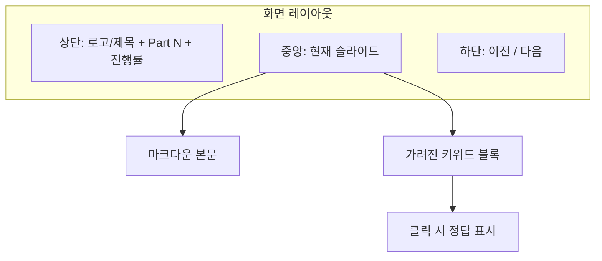

# 강의 슬라이드 Web UI 구현 계획

## 목표

- [강의자료_AI협업](강의자료_AI협업) 폴더의 Part 1~9 마크다운을 **슬라이드 단위**로 재구성해 웹에서 한 장씩 넘기며 볼 수 있게 한다.
- **키워드 가리기**: 중요한 용어를 가려 두었다가 클릭(또는 버튼) 시 공개하는 퀴즈 느낌의 기능을 제공한다.

---

## 1. 기술 스택 및 프로젝트 위치

- **프레임워크**: Vite + React (빌드/개발 경량, 슬라이드 상태 관리 용이)
- **스타일**: Tailwind CSS
- **마크다운 렌더링**: `react-markdown` (기존 본문이 마크다운이므로)
- **배치**: `AI스터디` 하위에 `강의-슬라이드`(또는 `lecture-slides`) 프로젝트를 새로 두고, 강의 데이터는 해당 프로젝트의 `public/` 또는 `src/data/`에 둔다. 기존 `강의자료_AI협업` 마크다운은 수정하지 않고, **슬라이드용 데이터만 새로 생성**한다.

---

## 2. 데이터 구조

슬라이드 한 장을 다음 형태로 표현한다.

```ts
// 슬라이드 한 장
interface Slide {
  id: string;
  type: 'title' | 'content' | 'list' | 'quote';  // 레이아웃/스타일 구분용
  title?: string;           // 섹션 제목 (예: "Rules란?")
  content: string;          // 마크다운 문자열
  blanks?: Array<{          // 가릴 키워드 (퀴즈용)
    id: string;
    placeholder?: string;   // 가려진 상태 문구 (기본 "???")
    answer: string;         // 공개할 키워드
  }>;
}

// Part 한 묶음
interface Part {
  partNumber: number;
  title: string;
  slides: Slide[];
}
```

- **키워드 가리기 표현**: `content` 안에 특정 문법으로 표시한다. 예: `**Rules** = AI에게 지켜야 할 **[BLANK:운영 원칙]`**  
→ 파싱 시 `[BLANK:운영 원칙]` 구간을 “가린 블록”으로 치환하고, 클릭 전에는 `placeholder`, 클릭 후에는 `운영 원칙`을 보여 준다.
- **데이터 파일**: `src/data/slides.json` 한 파일에 Part 1~9를 모두 넣거나, Part별로 `part1.json` ~ `part9.json`로 나누어 두고 앱에서 합쳐서 사용한다. (초기에는 단일 JSON으로 단순화 권장.)

---

## 3. 슬라이드 데이터 생성 전략

- **소스**: [Part1_오프닝.md](강의자료_AI협업/Part1_오프닝.md) ~ [Part9_마무리.md](강의자료_AI협업/Part9_마무리.md) 의 본문을 기준으로 한다.
- **슬라이드 분할**: Part 하나를 “한 화면에 들어갈 양”으로 잘라 여러 장으로 만든다.  
  - 예: Part 1은 1~~2장, Part 5는 “Rules란?” / “Skills란?” / “한 줄 구분” / “프롬프트 vs Rules” 등으로 4~~6장.
- **blanks 지정**: 각 슬라이드에서 시청자가 맞춰 보면 좋은 핵심어(예: “운영 원칙”, “재사용 가능한 업무 모듈”, “source of truth”)를 골라 `[BLANK:해당키워드]` 형태로 content에 넣고, 동일 슬라이드의 `blanks` 배열에 `{ id, answer }` 를 넣는다. (파서가 content 내 `[BLANK:...]` 와 blanks를 매칭해도 됨.)
- **작업 방식**: 기존 MD를 직접 수정하지 않고, 새 프로젝트 안에 JSON(또는 TS 배열)으로만 슬라이드 데이터를 작성한다. Part 1~2만 먼저 만들어 동작 확인 후, 나머지 Part를 순차 추가한다.

---

## 4. UI 구성




- **상단**: 강의 제목, 현재 Part 번호, 슬라이드 진행률 (예: 3 / 24).
- **중앙**: 현재 슬라이드의 `content`를 마크다운으로 렌더링.  
  - `[BLANK:답]` 구간은 **가린 블록** 컴포넌트로 치환: 기본 상태에서는 회색 박스 + “클릭하여 공개”(또는 placeholder), 클릭 시 `답` 표시.
- **하단**: [이전] [다음] 버튼. (선택) 키보드 좌/우 화살표로 이전·다음 슬라이드 이동.
- **Part 이동**: Part 목차(목차.md 구조 참고)를 사이드 또는 상단 드롭다운으로 두고, Part 선택 시 해당 Part 첫 슬라이드로 이동할 수 있게 한다.

---

## 5. 핵심 컴포넌트

- **SlideViewer**: 현재 `partIndex`, `slideIndex`에 해당하는 슬라이드 한 장을 그린다. `content`를 파싱해 마크다운 + Blank 컴포넌트로 조합한다.
- **Blank / RevealKeyword**: `answer`와 `placeholder`를 받아, 클릭 전에는 가린 UI, 클릭 후에는 `answer`를 표시. 상태는 상위(SlideViewer 또는 슬라이드 단위 상태)에서 “이 슬라이드에서 공개된 blank id 목록”으로 관리하면 된다.
- **Content 파서**: `content` 문자열에서 `[BLANK:...]` 를 정규식 등으로 찾아, 해당 구간만 RevealKeyword 컴포넌트로 치환하고 나머지는 `react-markdown`으로 렌더링한다. (한 문자열을 “일반 텍스트 구간”과 “BLANK 구간”으로 split한 뒤, 교차 렌더링.)

---

## 6. 구현 순서 제안


| 단계  | 작업                                                                                    |
| --- | ------------------------------------------------------------------------------------- |
| 1   | Vite + React + Tailwind 프로젝트 생성 (`강의-슬라이드` 또는 `lecture-slides`), 기본 레이아웃(상단/중앙/하단) 잡기 |
| 2   | 슬라이드 타입 정의 및 Part 1(오프닝)만 JSON으로 작성. 키워드 1~2개만 `[BLANK:...]` 로 넣어 테스트                 |
| 3   | `content` 파서 구현: `[BLANK:답]` 추출 후 RevealKeyword 컴포넌트와 조합해 한 슬라이드 렌더링                  |
| 4   | SlideViewer + 이전/다음 버튼, `slideIndex` 상태로 슬라이드 전환. (Part는 1개만 있어도 됨)                   |
| 5   | Part 2~9 슬라이드 데이터 추가(분할 + blanks 지정). Part 선택 UI 및 `partIndex` 연동                     |
| 6   | 진행률 표시, 키보드 좌/우 이벤트, (선택) “이 슬라이드 빈칸 모두 공개” 버튼                                        |


---

## 7. 결과물

- **실행**: `npm run dev` 로 로컬에서 슬라이드 확인. 필요 시 `npm run build` 후 정적 호스팅 배포.
- **데이터**: 슬라이드 내용 수정은 JSON(또는 데이터 파일)만 편집하면 되고, 기존 [강의자료_AI협업](강의자료_AI협업) 마크다운 파일은 그대로 둔다.
- **키워드 가리기**: 슬라이드 본문에서 `[BLANK:키워드]` 로 표시한 부분이 가려진 블록으로 보이고, 클릭 시 키워드가 공개되는 퀴즈 형식으로 동작한다.

이 계획대로 진행하면 “마크다운이 아닌 슬라이드 Web UI + 중간중간 키워드 가리기”가 구현된다.